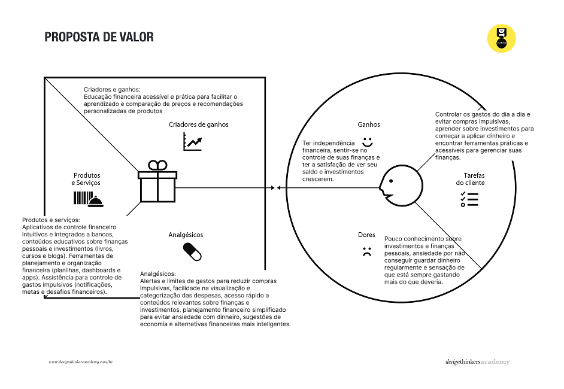
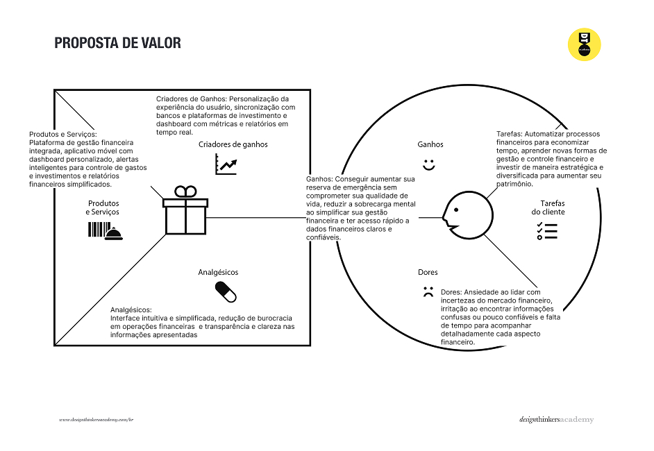
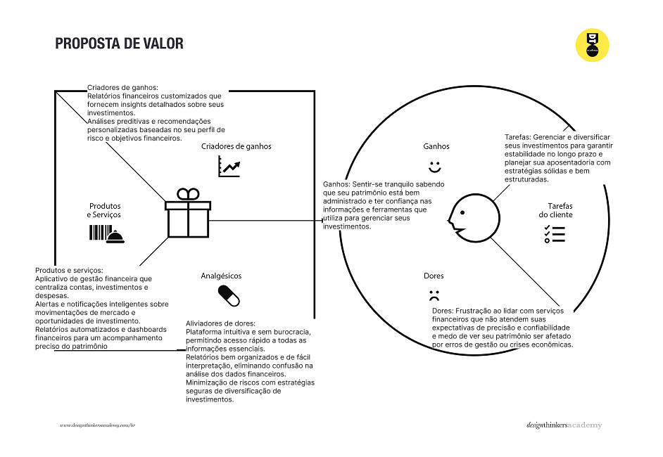

# Product design

Pré-requisitos: <a href="02-Product-discovery.md"> Product discovery</a>

Neste momento, transformam-se os insights e validações obtidos em soluções tangíveis e utilizáveis. Esta fase envolve a definição de uma proposta de valor, detalhando a prioridade de cada ideia, e a consequente criação de wireframes, mockups e protótipos de alta fidelidade, que especificam a interface e a experiência do usuário.

## Histórias de usuários

Com base na análise das personas, foram identificadas as seguintes histórias de usuários:

|EU COMO... `PERSONA`| QUERO/PRECISO ... `FUNCIONALIDADE` |PARA ... `MOTIVO/VALOR`                 |
|--------------------|------------------------------------|----------------------------------------|
|Gabriel Moreira  |Um aplicativo para administrar minhas finanças e gastos         |Praticidade com a sua gestão financeira               |
|Uma pessoa com pouco conhecimento no assunto, quero organizar minhas finanças.       |Acompanhar meus gastos por aplicativos e planilhas, para evitar compras impulsivas e administrar melhor meu orçamento.       |Ajudar a visualizar seus gastos e receitas em um só lugar, facilitando a organização financeira e evitando compras impulsivas. |
|Eduarda Vargas   |Ter um dashboard financeiro com gráficos interativos     |Visualizar rapidamente meus gastos, receitas e investimentos     |
|Gerente comercial      |Receber notificações sobre prazos de pagamento e vencimento de contas      |Evitar atrasos e manter minha saúde financeira em dia      |
|Carlos Garcia      |Uma plataforma que centralize todas as minhas contas bancárias, corretoras e ativos financeiros em um único lugar      |Ter uma visão unificada do meu patrimônio e facilitar a gestão financeira sem precisar acessar diferentes aplicativos e sites    |
|Um investidor experiente       |Receber notificações inteligentes sobre movimentações relevantes do mercado e oportunidades alinhadas ao meu perfil de investimento      |Agir rapidamente e tomar decisões estratégicas sem precisar monitorar o mercado manualmente o tempo todo     |

> **Links úteis**:
> - [Histórias de usuários com exemplos e template](https://www.atlassian.com/br/agile/project-management/user-stories)
> - [Como escrever boas histórias de usuário (user stories)](https://medium.com/vertice/como-escrever-boas-users-stories-hist%C3%B3rias-de-usu%C3%A1rios-b29c75043fac)
> - [User stories: requisitos que humanos entendem](https://www.luiztools.com.br/post/user-stories-descricao-de-requisitos-que-humanos-entendem/)
> - [Histórias de usuários: mais exemplos](https://www.reqview.com/doc/user-stories-example.html)
> - [9 common user story mistakes](https://airfocus.com/blog/user-story-mistakes/)

## Proposta de valor

##### Proposta para a persona Gabriel Moreira

##### Proposta para a persona Eduarda Vargas

##### Proposta para a persona Carlos Garcia

> **Links úteis**:
> - [O que é o canvas da proposta de valor e como usar?](https://www.youtube.com/watch?v=Iqb-8Q_eiiA)

## Requisitos

As tabelas a seguir apresentam os requisitos funcionais e não funcionais que detalham o escopo do projeto. Para determinar a prioridade dos requisitos, aplique uma técnica de priorização e detalhe como essa técnica foi aplicada.

### Requisitos funcionais

| ID     | Descrição do Requisito                                   | Prioridade |
| ------ | ---------------------------------------------------------- | ---------- |
| RF-001 | O sistema deve permitir que o usuário cadastre suas receitas e despesas. | ALTA       |
| RF-002 | - O sistema deve exibir um painel interativo com gráficos e relatórios financeiros. | MÉDIA     |

### Requisitos não funcionais

| ID      | Descrição do Requisito                                                              | Prioridade |
| ------- | ------------------------------------------------------------------------------------- | ---------- |
| RNF-001 | O sistema deverá estar disponível 24/7 para acesso contínuo. | ALTA     |
| RNF-002 | A interface do sistema deve ser simples e intuitiva, evitando burocracia para o usuário.          | MÉDIA     |
| RNF-003 |  A plataforma deve garantir a segurança dos dados, protegendo informações bancárias e pessoais | ALTA |

> ⚠️ **APAGUE ESTA PARTE ANTES DE ENTREGAR SEU TRABALHO**
>
> Com base nas histórias de usuários, enumere os requisitos da sua solução. Classifique esses requisitos em dois grupos:

> **Links úteis**:
> - [O que são requisitos funcionais e requisitos não funcionais?](https://codificar.com.br/requisitos-funcionais-nao-funcionais/)
> - [Entenda o que são requisitos de software, a diferença entre requisito funcional e não funcional, e como identificar e documentar cada um deles](https://analisederequisitos.com.br/requisitos-funcionais-e-requisitos-nao-funcionais-o-que-sao/)

## Restrições

Enumere as restrições à sua solução. Lembre-se de que as restrições geralmente limitam a solução candidata.

O projeto está restrito aos itens apresentados na tabela a seguir.

|ID| Restrição                                             |
|--|-------------------------------------------------------|
|001| O projeto deverá ser entregue até o final do semestre  |
|002| Não é permitido o desenvolvimento de um módulo de back-end   |