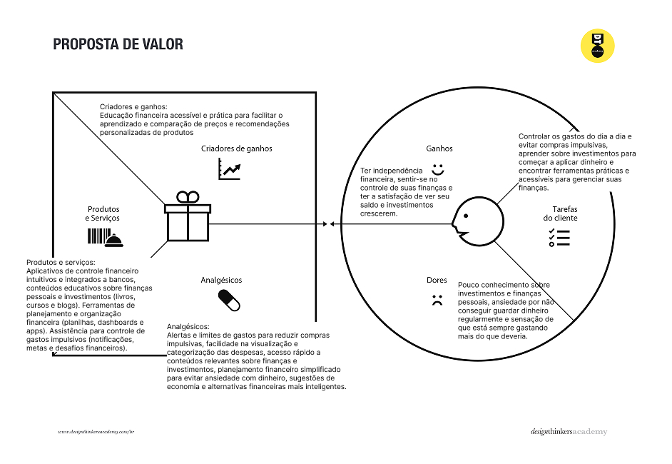
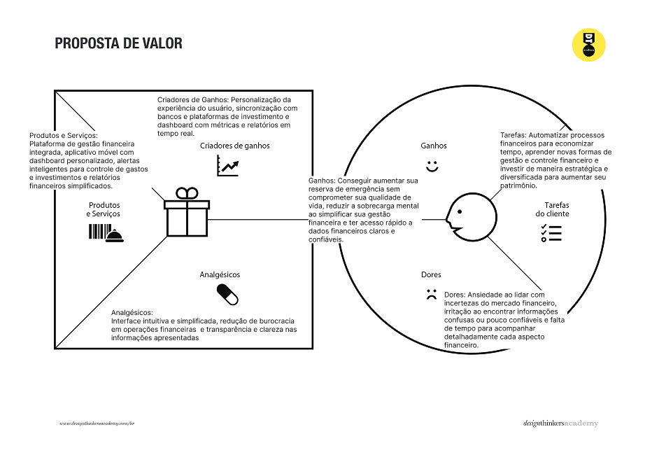
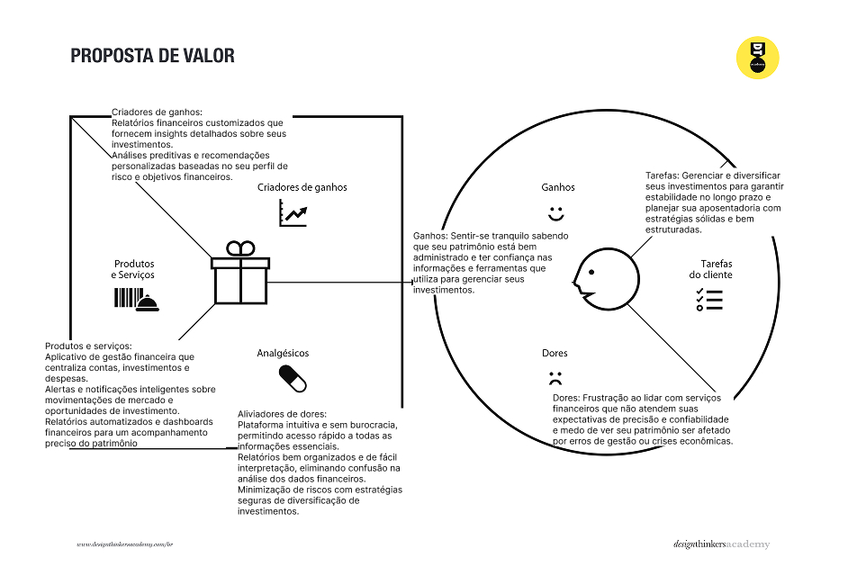

# Product design

Pré-requisitos: <a href="02-Product-discovery.md"> Product discovery</a>

Neste momento, transformam-se os insights e validações obtidos em soluções tangíveis e utilizáveis. Esta fase envolve a definição de uma proposta de valor, detalhando a prioridade de cada ideia, e a consequente criação de wireframes, mockups e protótipos de alta fidelidade, que especificam a interface e a experiência do usuário.

## Histórias de usuários

Com base na análise das personas, foram identificadas as seguintes histórias de usuários:

|EU COMO... `PERSONA`| QUERO/PRECISO ... `FUNCIONALIDADE` |PARA ... `MOTIVO/VALOR`                 |
|--------------------|------------------------------------|----------------------------------------|
|Gabriel Moreira  |  Cadastrar minhas receitas e despesas | Manter o controle do que ganho e gasto |
|Uma pessoa com pouco conhecimento no assunto, quero organizar minhas finanças. | Ver o saldo mensal de receitas e despesas  | Acompanhar meu desempenho financeiro no mês |
|Eduarda Vargas  |Visualizar o saldo atual total | Saber quanto dinheiro tenho disponível no momento |
|Gerente comercial |  Visualizar um gráfico do balanço do mês | Entender se fechei o mês no positivo ou negativo |
|Carlos Garcia   | Classificar minhas receitas e despesas por categorias | Organizar melhor meus gastos e identificar onde estou investindo meu dinheiro |
|Gabriel Moreira | Visualizar minhas receitas e despesas mais recentes | Ter acesso rápido às últimas movimentações financeiras |
|Eduarda Vargas  | Visualizar o saldo de cada conta cadastrada | Saber quanto tenho em cada banco ou carteira |
|Gabriel Moreira | Visualizar gráficos de receitas e despesas por categoria |  Entender melhor meus hábitos de consumo e identificar excessos |
|Carlos Garcia   | Alterar receitas e despesas já cadastradas | Corrigir possíveis erros ou atualizar informações |
|Eduarda Vargas  | Excluir receitas e despesas |Remover lançamentos duplicados ou que não são mais válidos  |
|Gabriel Moreira | Adicionar uma descrição às minhas despesas | Lembrar o motivo ou o contexto de cada gasto |

## Proposta de valor

##### Proposta para a persona Gabriel Moreira

##### Proposta para a persona Eduarda Vargas

##### Proposta para a persona Carlos Garcia

## Requisitos

As tabelas a seguir apresentam os requisitos funcionais e não funcionais que detalham o escopo do projeto. Para determinar a prioridade dos requisitos, aplique uma técnica de priorização e detalhe como essa técnica foi aplicada.

### Requisitos funcionais

| ID     | Descrição do Requisito                                   | Prioridade |
| ------ | ---------------------------------------------------------- | ---------- |
| RF-001 | O sistema deve permitir que o usuário cadastre suas receitas e despesas. | ALTA |
| RF-002 | O sistema deve exibir um gráfico do balanço do mês | MÉDIA |
| RF-003 | O sistema deve permitir a classificação de receitas e despesas por categorias. | MÉDIA |
| RF-004 | O sistema deve exibir o saldo atual total | ALTA |
| RF-005 | O sistema deve exibir o saldo mensal de receitas e despesas. | MÉDIA |
| RF-006 | O sistema deve exibir as receitas e despesas recentes | ALTA |
| RF-007 | O sistema deve exibir o saldo das contas do usuário | MÉDIA |
| RF-008 | O sistema deve exibir gráficos de receitas e despesas por categoria | MÉDIA |
| RF-009 | O sistema deve permitir que o usuário altere suas receitas e despesas | ALTA |
| RF-010 | O sistema deve permitir que o usuário exclua suas receitas e despesas | ALTA |
| RF-011 | O sistema deve permitir que o usuário adicione uma descrição nas suas despesas | BAIXA |

### Requisitos não funcionais

| ID      | Descrição do Requisito                                                              | Prioridade |
| ------- | ------------------------------------------------------------------------------------- | ---------- |
| RNF-001 | O sistema deverá estar disponível 24/7 para acesso contínuo. | ALTA     |
| RNF-002 | A interface do sistema deve ser simples e intuitiva, evitando burocracia para o usuário.          | MÉDIA     |
| RNF-003 |  A plataforma deve garantir a segurança dos dados, protegendo informações bancárias e pessoais | ALTA |
| RNF-004 |O sistema deverá ser responsivo e funcionar corretamente em dispositivos móveis | ALTA |
| RNF-005 | O sistema deve ser otimizado, permitindo um rápido acesso | MÉDIA |

## Restrições

Enumere as restrições à sua solução. Lembre-se de que as restrições geralmente limitam a solução candidata.

O projeto está restrito aos itens apresentados na tabela a seguir.

|ID| Restrição                                             |
|--|-------------------------------------------------------|
|001| O projeto deverá ser entregue até o final do semestre  |
|002| Não é permitido o desenvolvimento de um módulo de back-end   |