# Projeto de interface

Pré-requisitos: <a href="03-Product-design.md"> product design</a>

 ## User flow

Fluxo de usuário (user flow) é uma técnica que permite ao desenvolvedor mapear todo o fluxo de navegação do usuário na aplicação. Essa técnica serve para alinhar os caminhos e as possíveis ações que o usuário pode realizar junto com os membros da equipe.

> **Links úteis**:
> - [User flow: o quê é e como fazer?](https://medium.com/7bits/fluxo-de-usu%C3%A1rio-user-flow-o-que-%C3%A9-como-fazer-79d965872534)
> - [User flow vs site maps](http://designr.com.br/sitemap-e-user-flow-quais-as-diferencas-e-quando-usar-cada-um/)
> - [Top 25 user flow tools & templates for smooth](https://www.mockplus.com/blog/post/user-flow-tools)

## Wireframes

São protótipos usados no design de interface para sugerir a estrutura de um site web e seu relacionamento entre suas páginas. Um wireframe web é uma ilustração que mostra o layout dos elementos fundamentais na interface.

##### TELA CRIAR CONTA

Descrição para a tela XPTO

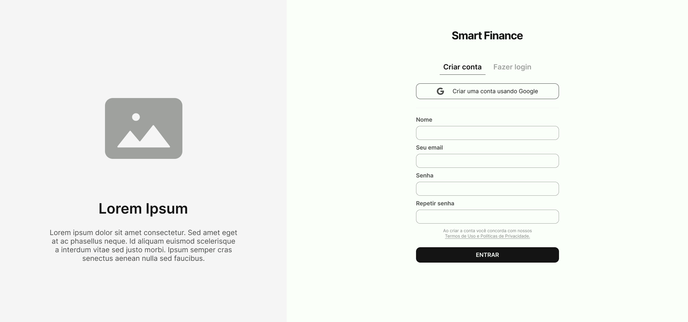

##### TELA FAZER LOGIN

Descrição para a tela XPTO

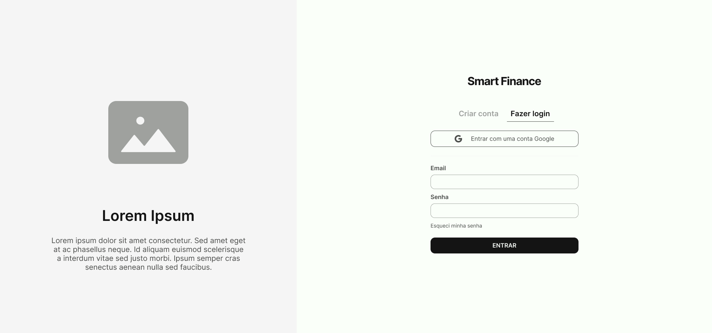

##### TELA ESQUECEU A SENHA

Descrição para a tela XPTO

##### TELA SOLICITAÇÃO REALIZADA

Descrição para a tela XPTO

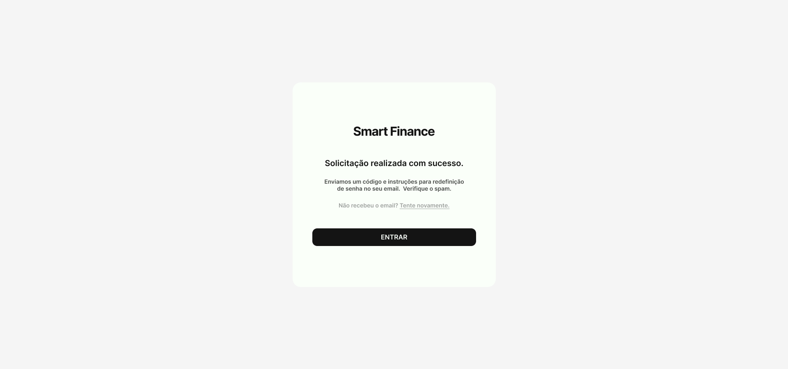

##### TELA CADASTRAR A NOVA SENHA

Descrição para a tela XPTO

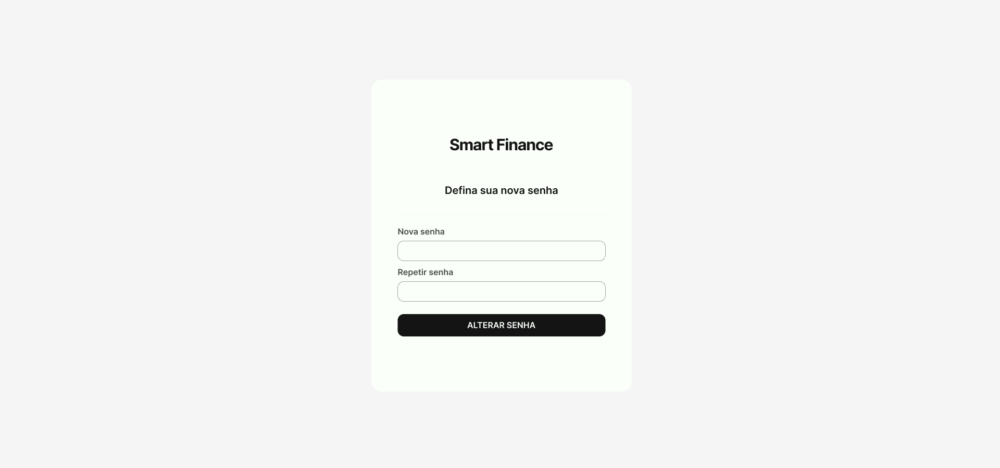

##### TELA ACESSAR A CONTA APÓS A TROCA DE SENHA

Descrição para a tela XPTO

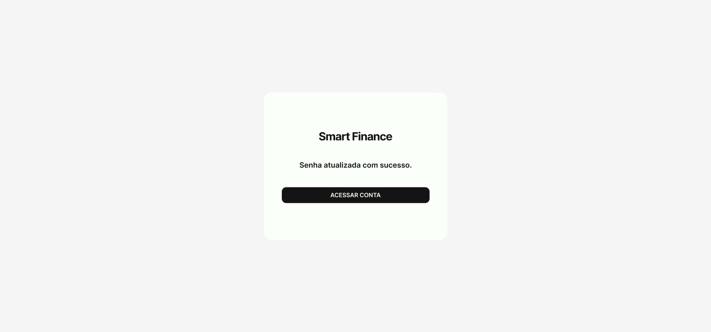

##### TELA DE INÍCIO E VISÃO GERAL

Descrição para a tela XPTO

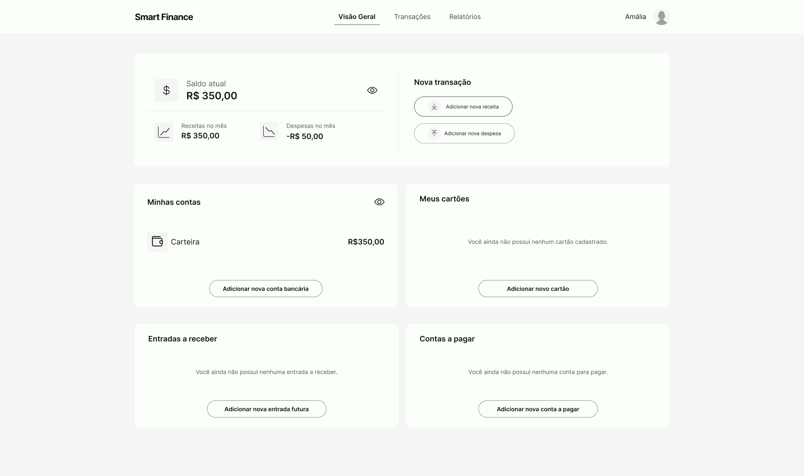

##### TELA DE TRANSAÇÕES POR DATA

Descrição para a tela XPTO

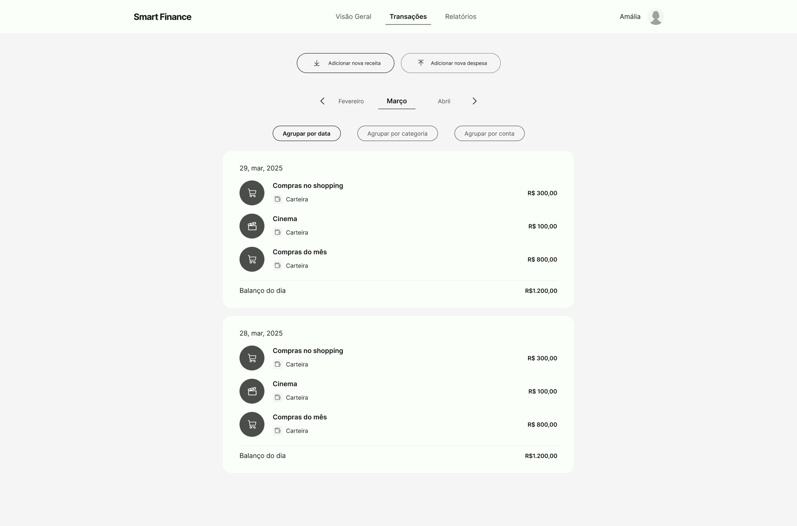

##### TELA DE TRANSAÇÕES POR CATEGORIA

Descrição para a tela XPTO

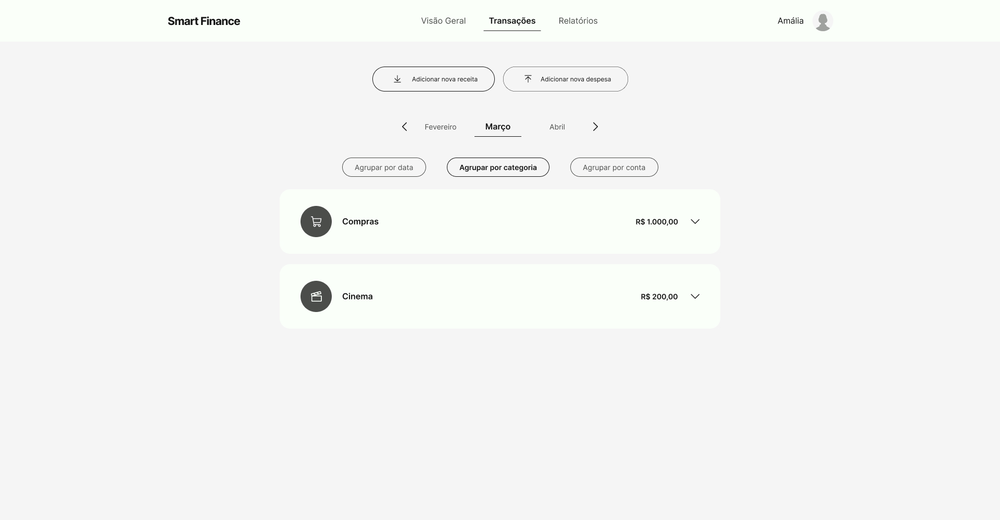

##### TELA DE TRANSAÇÕES POR CONTA

Descrição para a tela XPTO

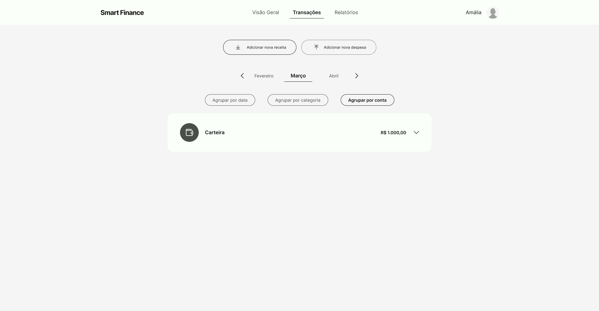

##### TELA DE RELATÓRIOS

Descrição para a tela XPTO

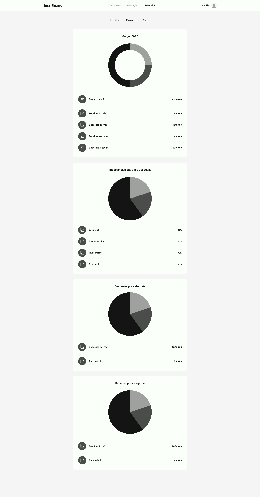

##### TELA CONGIGURAÇÕES DA CONTA

Descrição para a tela XPTO

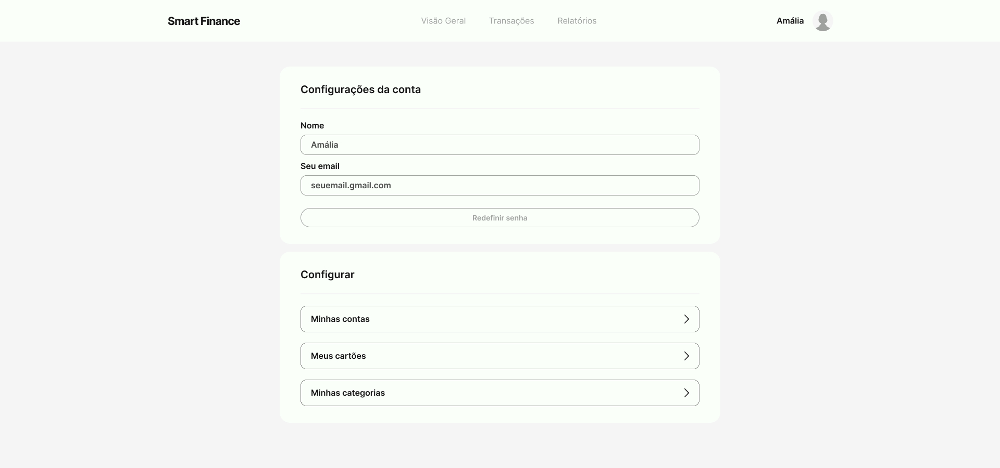

 
> **Links úteis**:
> - [Protótipos: baixa, média ou alta fidelidade?](https://medium.com/ladies-that-ux-br/prot%C3%B3tipos-baixa-m%C3%A9dia-ou-alta-fidelidade-71d897559135)
> - [Protótipos vs wireframes](https://www.nngroup.com/videos/prototypes-vs-wireframes-ux-projects/)
> - [Ferramentas de wireframes](https://rockcontent.com/blog/wireframes/)
> - [Figma](https://www.figma.com/)
> - [MarvelApp](https://marvelapp.com/developers/documentation/tutorials/)
> - [Adobe XD](https://www.adobe.com/br/products/xd.html#scroll)

### Protótipo Interativo

✅ [Protótipo interativo](https://www.figma.com/proto/i5GPYOFFEdrGdNAQuQYqHm/TIAW---Gest%C3%A3o-Financeira?node-id=62-2412&starting-point-node-id=62%3A2412)