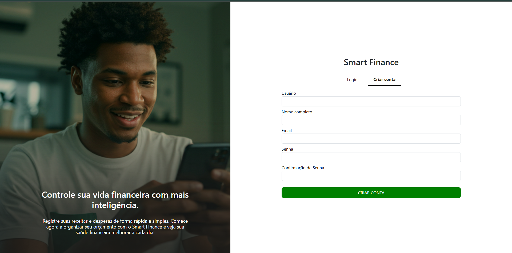
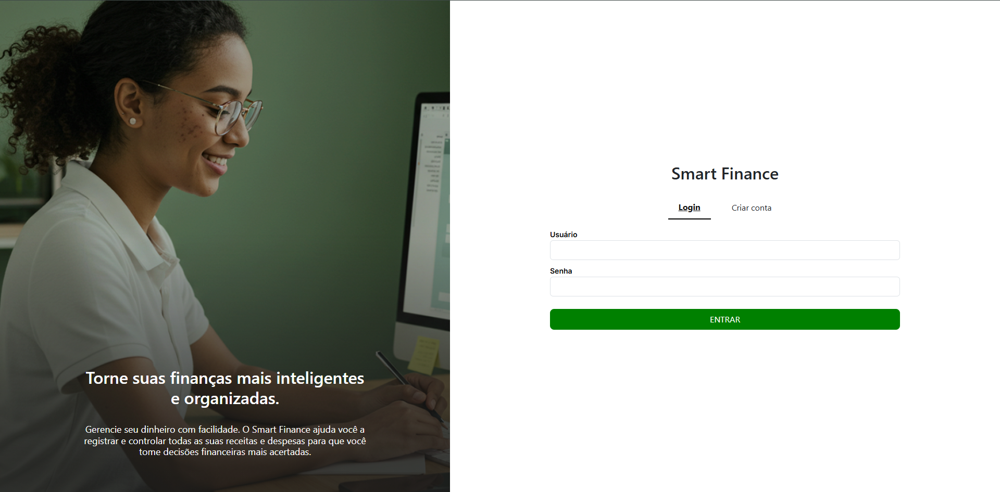
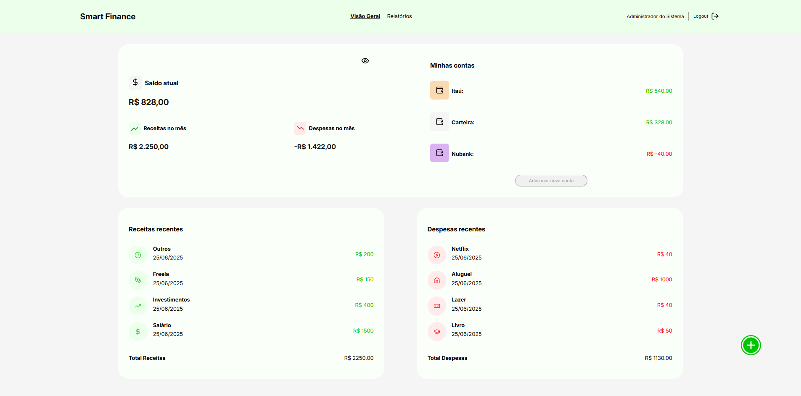
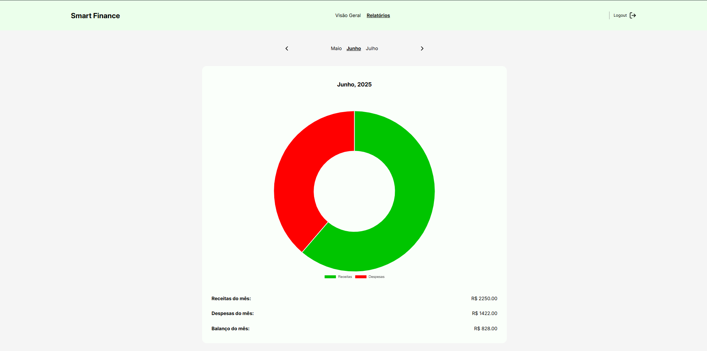
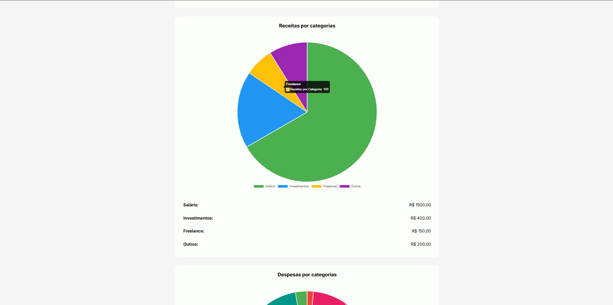
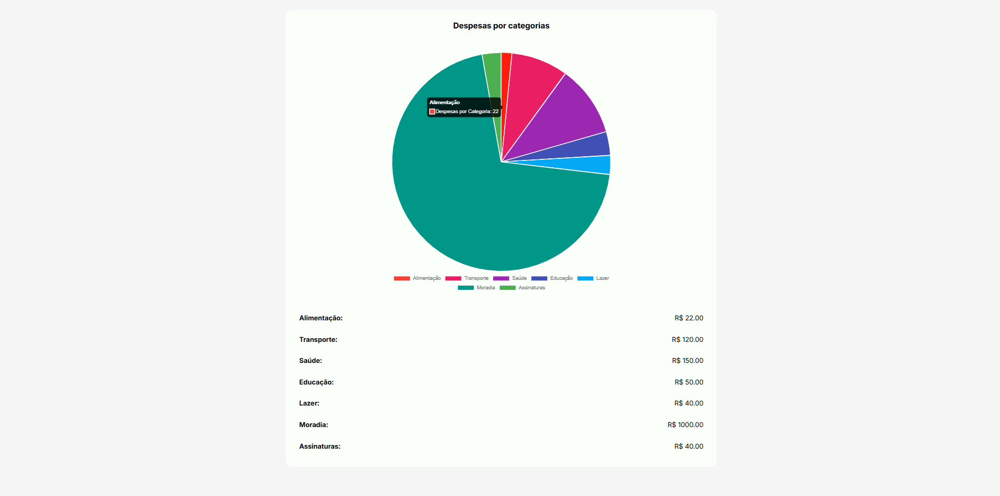

# Projeto de interface

Pré-requisitos: <a href="03-Product-design.md"> product design</a>

## User flow

Fluxo de usuário (user flow) é uma técnica que permite ao desenvolvedor mapear todo o fluxo de navegação do usuário na aplicação. Essa técnica serve para alinhar os caminhos e as possíveis ações que o usuário pode realizar junto com os membros da equipe

## Wireframes

São protótipos usados no design de interface para sugerir a estrutura de um site web e seu relacionamento entre suas páginas, um wireframe web é uma ilustração que mostra o layout dos elementos fundamentais na interface

##### TELA CRIAR CONTA

Tela onde o usuário pode criar uma nova conta, informando nome, e-mail, senha e confirmação de senha. Possui botão para finalizar o cadastro e link para voltar à tela de login. O objetivo é permitir que novos usuários se registrem de forma simples e rápida

##### TELA FAZER LOGIN

Tela para o usuário realizar login na sua conta já existente, inserindo e-mail e senha. Inclui opção de lembrar login, botão para acessar a conta e link para recuperação de senha caso o usuário tenha esquecido. Facilita o acesso seguro e rápido ao sistema

##### TELA DE INÍCIO E VISÃO GERAL

Tela principal após o login, onde o usuário acessa as principais funções do sistema. Exibe o saldo atual, receitas e despesas do mês, além das transações mais recentes. Possui botões para adicionar nova receita ou despesa e atalhos para acessar relatórios detalhados. Ajuda o usuário a ter uma visão clara e rápida de sua situação financeira

##### TELA DE RELATÓRIOS

Tela onde o usuário visualiza relatórios financeiros por mês, podendo acompanhar a evolução das receitas e despesas ao longo do tempo. Permite selecionar o mês desejado e visualizar gráficos de desempenho financeiro, facilitando o acompanhamento e a tomada de decisões

Relatório de receitas por categoria no mês, exibindo um gráfico que mostra quanto foi recebido em cada categoria (ex: salário, investimentos, etc). Ajuda o usuário a identificar as principais fontes de receita

Relatório de gastos por categoria no mês, apresentando um gráfico que detalha quanto foi gasto em cada categoria (ex: alimentação, transporte, lazer). Auxilia o usuário a entender para onde está indo seu dinheiro e a planejar melhor seus gastos

### Protótipo Interativo

✅ [Protótipo interativo](https://www.figma.com/proto/i5GPYOFFEdrGdNAQuQYqHm/TIAW---Gest%C3%A3o-Financeira?node-id=62-2412&starting-point-node-id=62%3A2412)