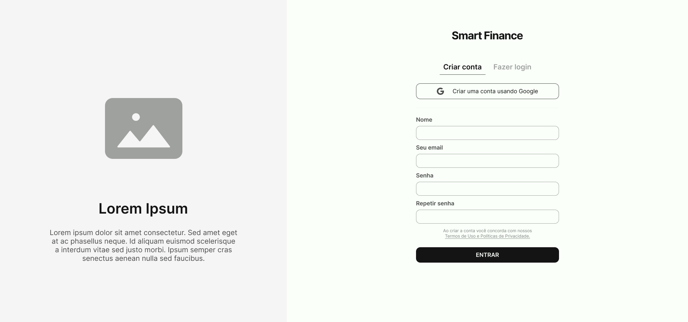
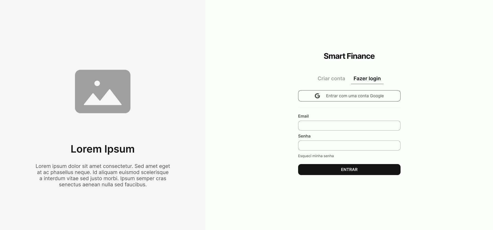
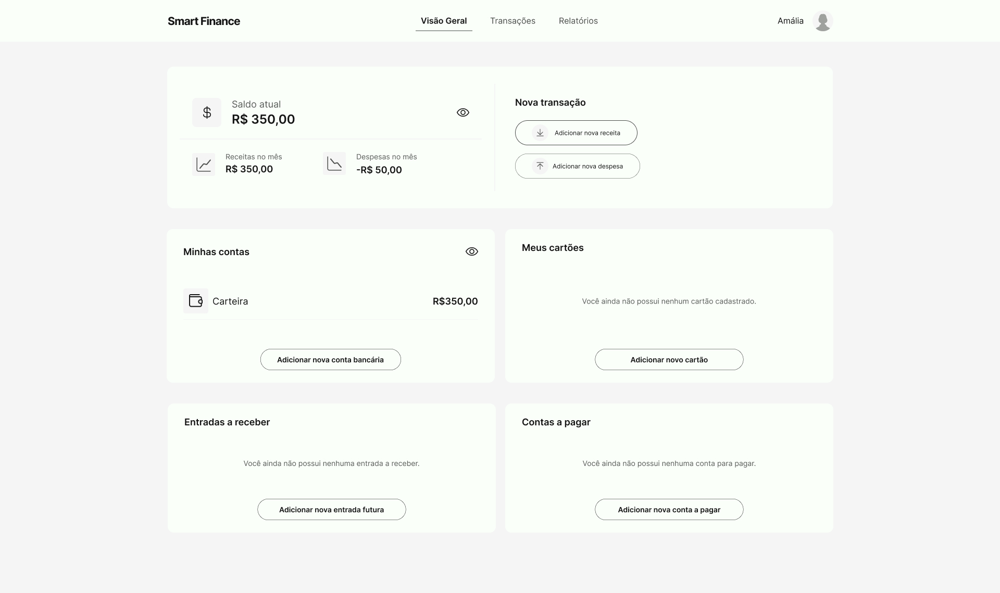
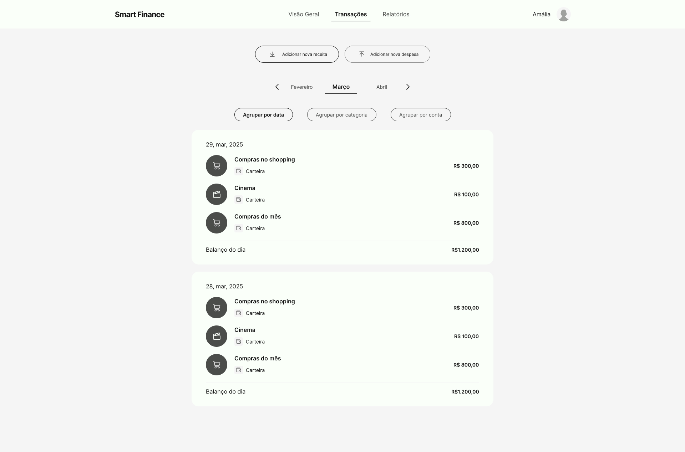
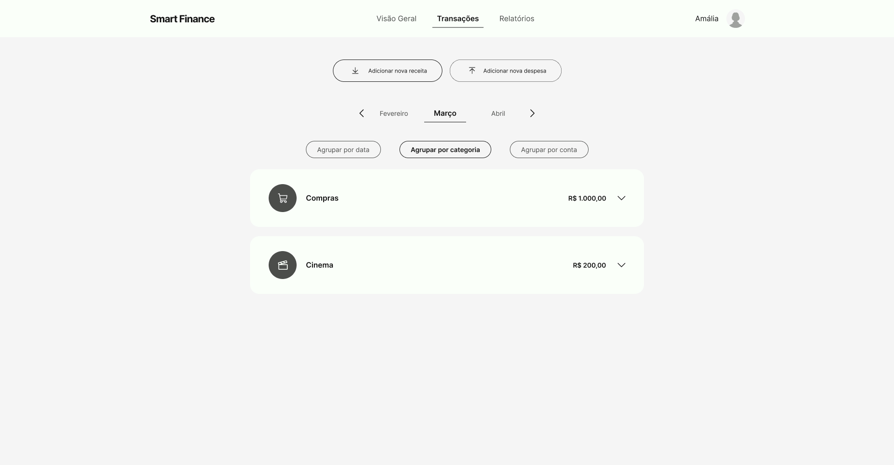
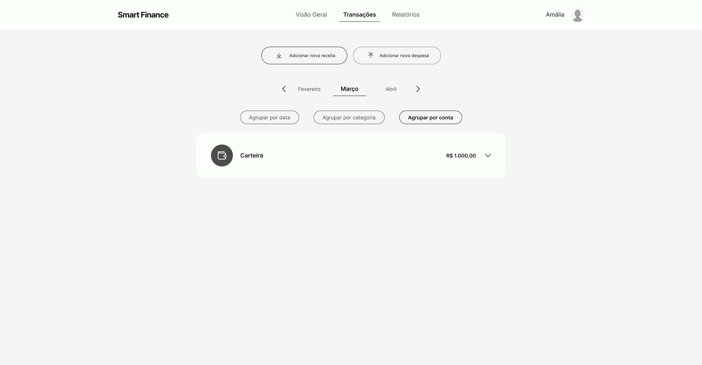
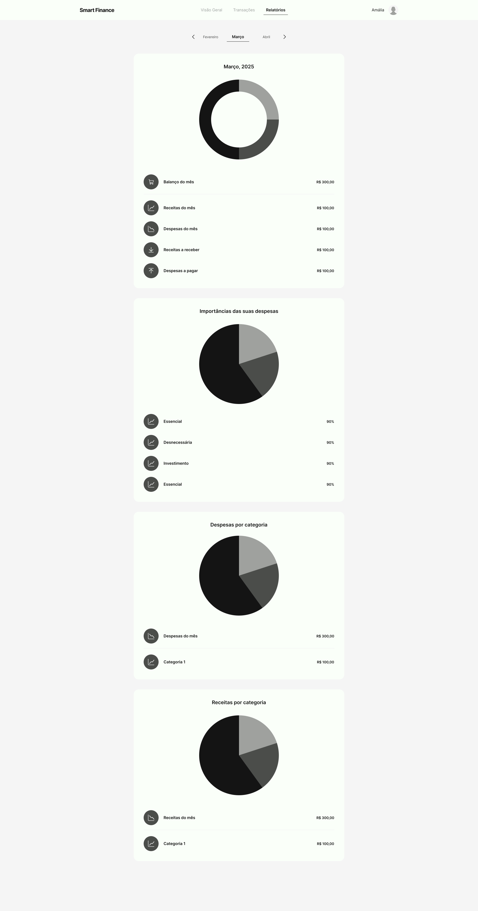
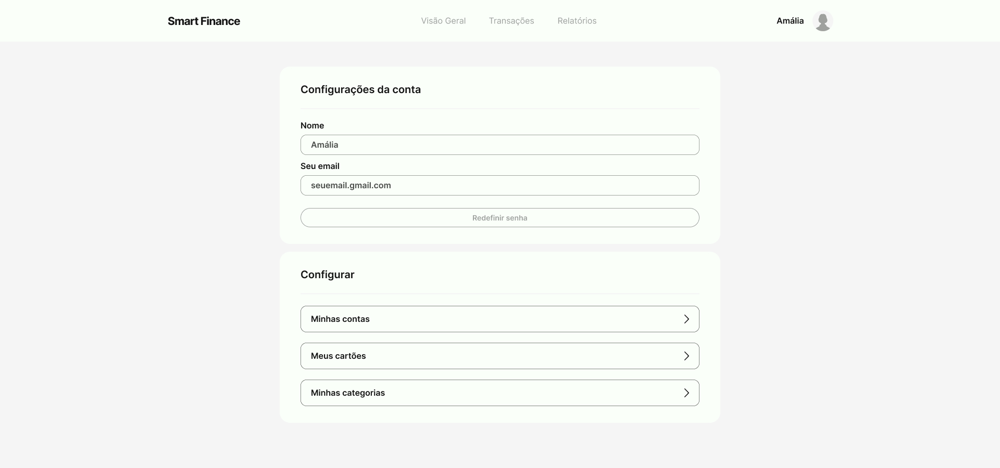

# Projeto de interface

Pré-requisitos: <a href="03-Product-design.md"> product design</a>

 ## User flow

Fluxo de usuário (user flow) é uma técnica que permite ao desenvolvedor mapear todo o fluxo de navegação do usuário na aplicação. Essa técnica serve para alinhar os caminhos e as possíveis ações que o usuário pode realizar junto com os membros da equipe.

## Wireframes

São protótipos usados no design de interface para sugerir a estrutura de um site web e seu relacionamento entre suas páginas. Um wireframe web é uma ilustração que mostra o layout dos elementos fundamentais na interface.

##### TELA CRIAR CONTA

Tela onde o usuário pode criar uma nova conta

##### TELA FAZER LOGIN

Tela para o usuário realizar login na sua conta já existente

##### TELA DE INÍCIO E VISÃO GERAL

Tela onde o usuário acessa as principais funções, visualiza o seu saldo atual, as receitas e despeas no mês, pode adicionar uma nova receita ou despesa e visualiza as transações mais recentes.

##### TELA DE TRANSAÇÕES POR DATA

Tela onde filtra as transações do mês atual e agrupa pela data

##### TELA DE TRANSAÇÕES POR CATEGORIA

Tela onde filtra as transações do mês atual e agrupa por categorias

##### TELA DE TRANSAÇÕES POR CONTA

Tela onde filtra as transações do mês atual e agrupa por contas

##### TELA DE RELATÓRIOS

Tela onde o usuário visualiza os seus relatórios por mês

##### TELA CONGIGURAÇÕES DA CONTA

Tela onde o usuário pode realizar configuração básicas da sua conta

 
> **Links úteis**:
> - [Protótipos: baixa, média ou alta fidelidade?](https://medium.com/ladies-that-ux-br/prot%C3%B3tipos-baixa-m%C3%A9dia-ou-alta-fidelidade-71d897559135)
> - [Protótipos vs wireframes](https://www.nngroup.com/videos/prototypes-vs-wireframes-ux-projects/)
> - [Ferramentas de wireframes](https://rockcontent.com/blog/wireframes/)
> - [Figma](https://www.figma.com/)
> - [MarvelApp](https://marvelapp.com/developers/documentation/tutorials/)
> - [Adobe XD](https://www.adobe.com/br/products/xd.html#scroll)

### Protótipo Interativo

✅ [Protótipo interativo](https://www.figma.com/proto/i5GPYOFFEdrGdNAQuQYqHm/TIAW---Gest%C3%A3o-Financeira?node-id=62-2412&starting-point-node-id=62%3A2412)