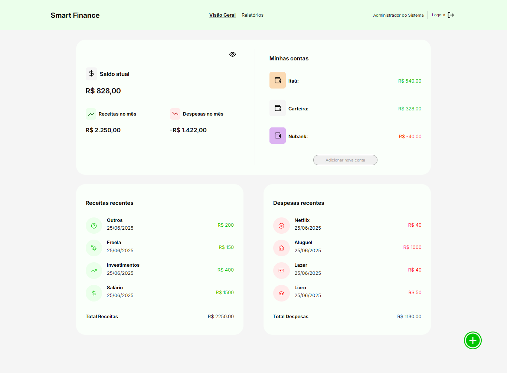

# Template padrão da aplicação

<span style="color:red">Pré-requisitos: <a href="03-Product-design.md"> Especificação do projeto</a></span>, <a href="04-Metodologia.md"> Metodologia</a>, <a href="05-Projeto-interface.md"> Projeto de interface</a>

Layout padrão da aplicação que será utilizado em todas as páginas com a definição de identidade visual, aspectos de responsividade e iconografia.

Exemplo do template padrão da aplicação em uso:



Utilizaremos como padronização das cores e fontes as seguintes, especificadas em CSS como variáveis:

```
:root {
    --Verde: #00C500;
    --Verde-escuro: #008000;
    --Verde-claro: #EBFFEB;
    --red-50: #FFEBEB;
    --red-500: #F00;
    --gray-50: #FAFFFA;
    --gray-100: #F5F5F5;
    --gray-600: #9EA19E;
    --gray-700: #4B4D4B;
    --gray-900: #141414;
    --fontfamily: "Inter", sans-serif;
}
```

Escolhemos a fonte Inter por combinar perfeitamente com os pilares do Smart Finance: clareza, modernidade, confiança e foco no usuário. É uma tipografia funcional, contemporânea e compatível com os objetivos de uma plataforma de gestão financeira digital.

As cores escolhemos cada uma pensando na psicologia das cores e na usabilidade:

| DESCRIÇÃO | COR |VARIÁVEL|
|--------------------|------------------------------------|----------------------------------------|
|A nossa principal cor foi escolhida pensando que é uma cor tradicionalmente associado a dinheiro, crescimento e estabilidade, o que o torna ideal para uma aplicação financeira. Ela será utilizada para dar destaques. | | var(--Verde) |
|Verde escuro traz seriedade, confiança e solidez, reforçando a credibilidade da marca.| | var(--Verde-escuro) |
|Verde claro transmite leveza, frescor e acolhimento — útil para fundos ou elementos de alívio visual. Utilizamos para detalhes em itens de receitas. | | var(--Verde-claro) |
|Vermelho claro  reduz a agressividade visual, mantendo o alerta sem causar desconforto. Utilizado em detalhes de itens de despesas| | var(--red-50) |
|Vermelho é naturalmente associado a gastos e situações negativas, instantaneamente reconhecível como um sinal de alerta e capaz de orientar comportamentos, incentivando o usuário a refletir, ajustar e controlar melhor seus hábitos financeiros. Utilizamos para representar despesas ou saldos negativos. | | var(--red-500) |
|A versão mais clara de cinza é utilizada em fundos que possuem algum elemento e precisam de uma devida atenção. | | var(--gray-50) |
|Uma tonalidade suavizada do branco foi utilizada nos fundos para proporcionar maior conforto visual. Diferente do branco puro, essa variação reduz o brilho excessivo da tela, evitando fadiga ocular e contribuindo para uma experiência mais agradável e equilibrada durante o uso prolongado da aplicação. | | var(--gray-100) |
|Uma versão mais de cinza mais claro, utilizada para pequenos detalhes como divisores. | | var(--gray-600) |
|Essa tonalidade de cinza é forte o suficiente para garantir legibilidade, mas menos agressiva que o preto absoluto. Utilizada para textos, ícones e elementos secundários. | | var(--gray-700) |
|Um tom quase preto, ideal para criar hierarquia visual, dando ênfase a partes importantes da interface. Usado em títulos, áreas de destaque, rodapés ou contrastes fortes.| | var(--gray-900) |

Em relação a iconografia utilizaremos a biblioteca do Lucide (https://lucide.dev/icons/).