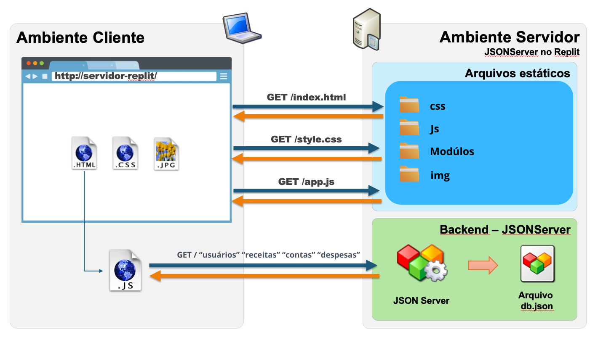
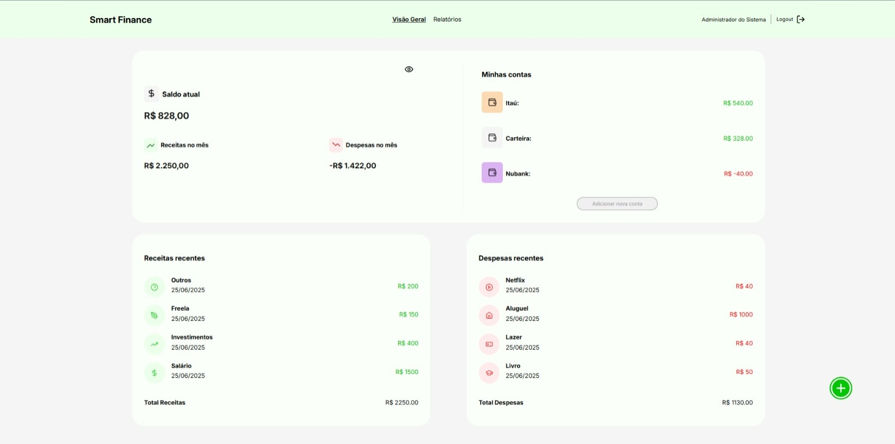
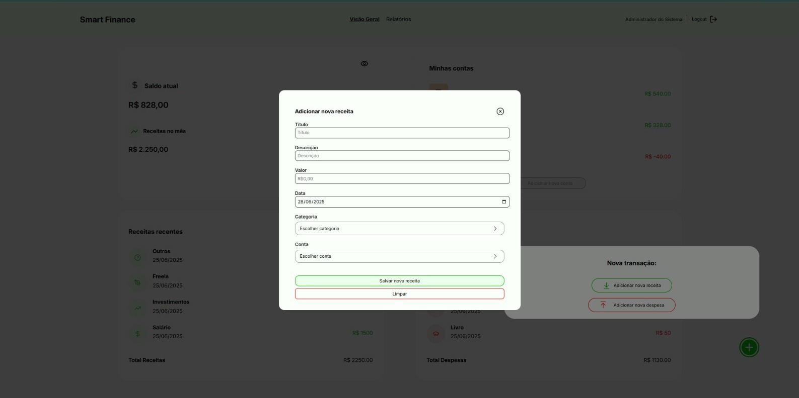
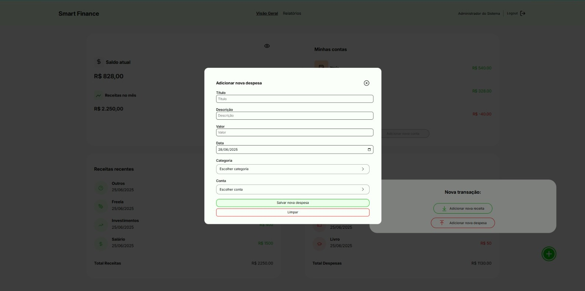
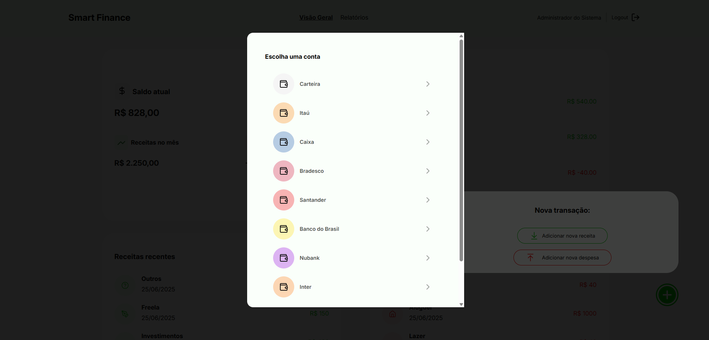
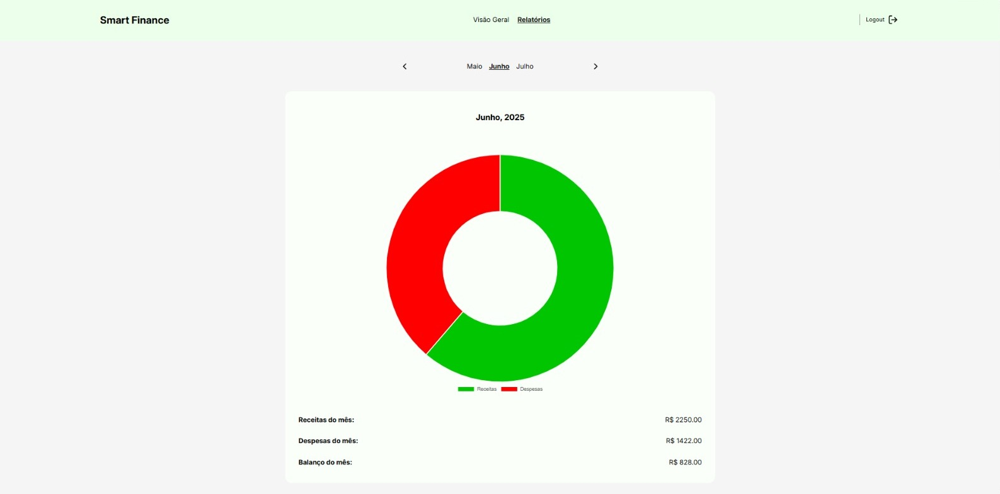
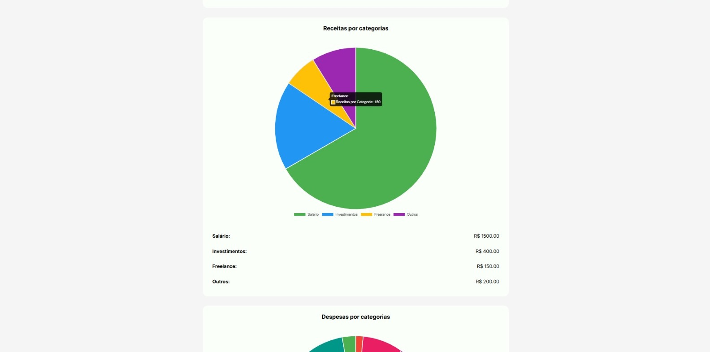
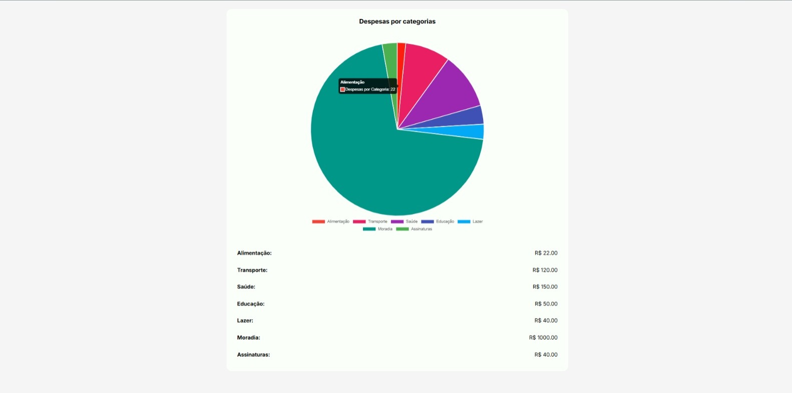

# Arquitetura da solução

<span style="color:red">Pré-requisitos: <a href="05-Projeto-interface.md"> Projeto de interface</a></span>

Documentação da Arquitetura da Solução
1. Visão Geral da Arquitetura
A arquitetura da solução proposta para o projeto Smart Finance segue o modelo cliente-servidor distribuído. Nesse modelo, o navegador (client-side) é responsável pela interface do usuário, enquanto o servidor (server-side) responde pelo fornecimento de arquivos estáticos e pela manipulação de dados simulada via JSON Server. O armazenamento de dados pode ocorrer localmente no navegador ou de forma persistente em um arquivo de banco de dados hospedado no servidor.

A imagem apresentada ilustra essa estrutura de maneira clara, destacando as requisições feitas pelo cliente para obter arquivos HTML, CSS, JS e imagens, além do consumo de dados via endpoints da API RESTful simulada (/usuários, /receitas, /contas, /despesas) utilizando o JSON Server conectado ao arquivo db.json.

2. Componentes da Solução
A solução é composta pelos seguintes elementos principais:

2.1 Navegador (Client-side)
Páginas Web (HTML + CSS + JS): Responsáveis por exibir a interface gráfica, capturar entradas do usuário, manipular o DOM e realizar requisições HTTP para o servidor.

Local Storage: Usado para armazenar temporariamente dados no navegador do usuário, como preferências, cache de informações ou sessões.

2.2 Hospedagem (Servidor)
Arquivos Estáticos: O servidor fornece os arquivos HTML, CSS, JS, imagens e módulos, que compõem a interface da aplicação.

JSON Server: Simula um backend RESTful, oferecendo endpoints para consulta, inserção e atualização de dados.

Banco de Dados (Simulado): Representado pelo arquivo db.json, serve como fonte de dados persistente utilizada pelo JSON Server.

2.3 API Externa (Opcional)
NewsAPI (ou APIs financeiras): Embora não apareça na imagem, o projeto pode ser estendido para consumir APIs externas, como serviços de cotação de moedas, notícias econômicas ou gráficos de investimento.

3. Fluxo de Dados e Interações
O funcionamento da aplicação segue o seguinte fluxo:

O navegador requisita os arquivos estáticos (index.html, style.css, app.js) ao servidor via HTTP.

O servidor entrega os arquivos, que são renderizados pelo navegador.

O arquivo JavaScript (app.js) realiza chamadas do tipo fetch para consumir dados dos endpoints do JSON Server.

Os dados retornados do backend (arquivo db.json) são utilizados para atualizar dinamicamente a interface.

Quando necessário, o navegador também pode gravar ou ler informações do localStorage.

Opcionalmente, o frontend pode acessar APIs externas para complementar os dados exibidos na interface.

4. Ambiente de Hospedagem da Aplicação
A aplicação pode ser hospedada em diversos ambientes, de acordo com os componentes utilizados:

Frontend (HTML, CSS, JS): Pode ser hospedado em plataformas de hospedagem estática como Vercel, Netlify ou GitHub Pages, que oferecem CDN, deploy automático e HTTPS gratuito.

Backend Simulado (JSON Server): Pode ser executado em ambientes como o Replit, ideal para protótipos e testes de APIs simuladas com base no db.json.

Backend Real (opcional): Em uma versão mais robusta da aplicação, um backend próprio (Node.js, .NET, etc.) e um banco de dados real (MongoDB, PostgreSQL, etc.) poderiam substituir o JSON Server.

APIs externas: Devem ser acessadas por meio de requisições HTTP (GET/POST) via JavaScript no navegador.

5. Pré-requisitos: Projeto de Interface
Para a implementação do projeto Smart Finance, os seguintes pré-requisitos devem ser atendidos:

HTML: Estruturação semântica e hierárquica das páginas.

CSS: Estilização responsiva, adaptada a diferentes tamanhos de tela.

JavaScript: Manipulação da interface, consumo de APIs e controle de armazenamento local.

Prototipação (Figma ou similar): Opcional, mas recomendada para validar a experiência do usuário (UX) antes da implementação definitiva.



## Funcionalidades

Funcionalidades
Esta seção apresenta as funcionalidades da solução Smart Finance.

Funcionalidade 1 – Visualização do saldo 
Permite ao usuário visualizar de forma rápida seu saldo atual, as receitas e despesas do mês, um resumo das suas contas bancárias e as Receitas e Despesas Recentes.

Estrutura de dados: [Saldo](#estrutura-de-dados---receitas),[Receitas](#estrutura-de-dados---receitas),[Despesas](#estrutura-de-dados---despesas).

Instruções de acesso:

Abra o site e efetue o login;

A tela inicial "Visão Geral" exibirá as informações consolidadas de saldo, minhas contas e Receitas e Despesas recentes.

Tela da funcionalidade: 

Funcionalidade 2 – Adicionar nova receita
Permite ao usuário registrar uma nova entrada de dinheiro no sistema, preenchendo informações como título, valor, data, categoria e conta de destino.

Estrutura de dados: [Receitas](#estrutura-de-dados---receitas) (Título, Descrição, Valor, Data, Categoria, Conta)

Instruções de acesso:

Abra o site e efetue o login;

Na tela "Visão Geral", clique no botão "+" no canto inferior direito;

No pop-up "Nova transação", clique em "Adicionar nova receita";

Preencha os campos obrigatórios;

Clique em "Salvar nova receita" para confirmar ou em "Limpar" para cancelar.

Tela da funcionalidade: 

Funcionalidade 3 – Adicionar nova despesa
Permite ao usuário registrar uma nova saída de dinheiro do sistema, informando detalhes da transação como valor, categoria e conta de origem.

Estrutura de dados: [Despesas](#estrutura-de-dados---despesas) (Título, Descrição, Valor, Data, Categoria, Conta)

Instruções de acesso:

Abra o site e efetue o login;

Na tela "Visão Geral", clique no botão "+" no canto inferior direito;

No pop-up "Nova transação", clique em "Adicionar nova despesa";

Preencha os campos obrigatórios;

Clique em "Salvar nova despesa" para confirmar ou em "Limpar" para cancelar.

Tela da funcionalidade: 

Funcionalidade 4 – Seleção de conta
Apresenta a lista de contas cadastradas para seleção ao registrar receitas ou despesas.

Estrutura de dados: [Contas](#estrutura-de-dados---contas)

Instruções de acesso:

Ao adicionar uma nova receita ou despesa, clique no campo "Conta";

Uma janela pop-up será exibida com a lista de contas disponíveis;

Clique na conta desejada e confirme a seleção.

Tela da funcionalidade: 

Funcionalidade 5 – Visualização de relatório de balanço mensal
Exibe um gráfico com o balanço financeiro do mês, indicando total de receitas, despesas e saldo.

Estrutura de dados: [Saldo](#estrutura-de-dados---receitas),[Receitas](#estrutura-de-dados---receitas),[Despesas](#estrutura-de-dados---despesas).

Instruções de acesso:

Abra o site e efetue o login;

Acesse o menu principal e clique na opção "Relatórios";

A tela apresentará o relatório do mês atual com gráfico e totais financeiros;

Utilize os botões "<" e ">" para navegar entre os meses.

Tela da funcionalidade: 

Funcionalidade 6 – Relatório de receitas por categorias
Exibe um gráfico de pizza com a distribuição das receitas do mês por categoria.

Estrutura de dados: ["Categorias de Receitas"](#estrutura-de-dados---Categorias-de-Receitas).

Instruções de acesso:

Abra o site e efetue o login;

Acesse o menu principal e clique na opção "Relatórios";

Role a tela até a seção "Receitas por categorias";

Um gráfico de pizza mostrará as proporções por categoria e a lista com os valores.

Tela da funcionalidade: 

Funcionalidade 7 – Relatório de despesas por categorias
Exibe um gráfico de pizza com a distribuição das despesas do mês por categoria.

Estrutura de dados: ["Categorias de Despesas"](#estrutura-de-dados---Categorias-de-Despesas).

Instruções de acesso:

Abra o site e efetue o login;

Acesse o menu principal e clique na opção "Relatórios";

Role a tela até a seção "Despesas por categorias";

Um gráfico de pizza mostrará as proporções por categoria e a lista com os valores.

Tela da funcionalidade: 


### Estruturas de dados

Descrição das estruturas de dados utilizadas na solução com exemplos no formato JSON.Info.


##### Estrutura de dados - Usuários

Estrutura de dados - Usuários

Registro dos usuários do sistema, utilizados para login e para o perfil do sistema.

```json
  {
    "id": "1",
    "login": "admin",
    "senha": "123",
    "nome": "Administrador do Sistema",
    "email": "admin@abc.com"
  }
```

##### Estrutura de dados - Receitas

Detalhes das entradas de dinheiro registradas pelo usuário.

```json
  {
    "id": "2",
    "titulo": "Salário Mensal",
    "valor": "1500",
    "data": "2025-06-22",
    "categoria": "Salário",
    "frequencia": "unica",
    "parcelas": "",
    "observacao": "Salário referente ao mês de junho",
    "conta": "Carteira"
  }
```

##### Estrutura de dados - Despesas

Detalhes das saídas de dinheiro registradas pelo usuário.

```json
  {
    "id": "1",
    "titulo": "Transporte Urbano",
    "valor": "200",
    "data": "2025-06-18",
    "categoria": "Transporte",
    "tipo": "essencial",
    "frequencia": "unica",
    "parcelas": "",
    "observacao": "Gastos com transporte público no mês",
    "conta": "Carteira"
  }
```

##### Estrutura de dados - Categorias-de-Receitas

Lista de categorias predefinidas para classificar as receitas.

```json
  {
    "id": "1",
    "nome": "Salário",
    "icon": "dollar-sign"
  }
```

##### Estrutura de dados - Categorias-de-Despesas

Lista de categorias predefinidas para classificar as despesas.

```json
  {
    "id": "2",
    "nome": "Transporte",
    "icon": "car"
  }
```

##### Estrutura de dados - Contas

Contas financeiras (Ex: Carteira, Contas Bancárias) que o usuário possui.

```json
  {
    "id": "1",
    "nome": "Carteira",
    "cor": "var(--gray-100)"
  }
```

##### Estrutura de dados - Pagamento

Tipos de método de pagamento (embora no db.json pareça mais relacionado a contas ou tipos de origem/destino de dinheiro, vou manter o nome "Pagamento" como você indicou, ou podemos ajustar para "Meios de Pagamento" ou "Tipos de Conta/Origem").

```json
  {
    "id": "1",
    "nome": "Conta Corrente"
  }
```

### Módulos e APIs

Módulos e APIs
Esta seção apresenta os módulos e APIs utilizados na solução Smart Finance, detalhando as bibliotecas, frameworks e serviços externos que compõem a aplicação.

1. Imagens:

Ícones SVG (Embutidos no HTML / Lucide Icons): Os ícones da interface (como o cifrão de saldo, setas de tendência, e o ícone de olho para visibilidade do saldo) são diretamente inseridos como SVG no HTML ou provêm da biblioteca Lucide Icons.
2. Fontes:

Lucide Icons - https://lucide.dev/
Uso: Para a maioria dos ícones vetoriais utilizados na interface do usuário (ex: ícones de saldo, receitas, despesas, ícone de olho).
Fontes do Sistema: A tipografia da aplicação utiliza fontes padrão do sistema ('Segoe UI', Tahoma, Geneva, Verdana, sans-serif).
3. Scripts e Frameworks Frontend:

JavaScript (Nativo): Toda a lógica de interatividade da interface, cálculos financeiros (saldo, receitas/despesas do mês), formatação de moeda e manipulação do DOM é realizada usando JavaScript puro.
Fetch API: Utilizada para fazer requisições assíncronas ao db.json para carregar os dados da aplicação.
CSS (Customizado): A estilização e o layout responsivo da aplicação são definidos em um arquivo CSS personalizado (style.css).
4. APIs Backend / Serviços:

JSON Server (ou Arquivo JSON Estático): A aplicação consome dados de um arquivo db.json, que atua como uma fonte de dados para usuários, receitas, despesas, categorias e contas. Isso geralmente é configurado com uma ferramenta como JSON Server para simular uma API RESTful em ambiente de desenvolvimento.
Uso: Persistência e acesso aos dados da aplicação (usuários, transações, categorias, contas).


## Hospedagem

Hospedagem e Lançamento da Plataforma
A hospedagem e o lançamento da plataforma "Smart Finance" foram realizados utilizando o Repl.it, uma plataforma de desenvolvimento online que oferece um ambiente de codificação, colaboração e hospedagem integrados.

1. Desenvolvimento e Colaboração com Repl.it:
O Repl.it foi a ferramenta central para o desenvolvimento do projeto. Ele permitiu a programação colaborativa, onde a equipe pôde escrever, testar e depurar o código diretamente no navegador. A estrutura do projeto, incluindo os arquivos de banco de dados (db.json), é gerenciada dentro do ambiente do Repl.it.

Link do Projeto no Repl.it:> - [Programação colaborativa com Repl.it](https://replit.com/@acgsamuel92/SmartFinance)

smart-finance no Repl.it - Este link direciona para o ambiente de desenvolvimento do projeto, onde o código-fonte, o banco de dados e outros arquivos são armazenados e editados.

2. Lançamento e Acesso à Plataforma:
Uma das principais vantagens do Repl.it é sua capacidade de hospedar e lançar aplicativos web diretamente do ambiente de desenvolvimento. Uma vez que o código é executado no Repl.it, ele automaticamente gera uma URL pública para a aplicação, tornando-a acessível na web.

Em resumo:
O Repl.it simplificou o processo de desenvolvimento e implantação ao integrar o IDE, o controle de versão (implícito) e a hospedagem. Isso permitiu que a equipe se concentrasse no código e nas funcionalidades, enquanto a plataforma se encarregava da disponibilização do "Smart Finance" na internet.
