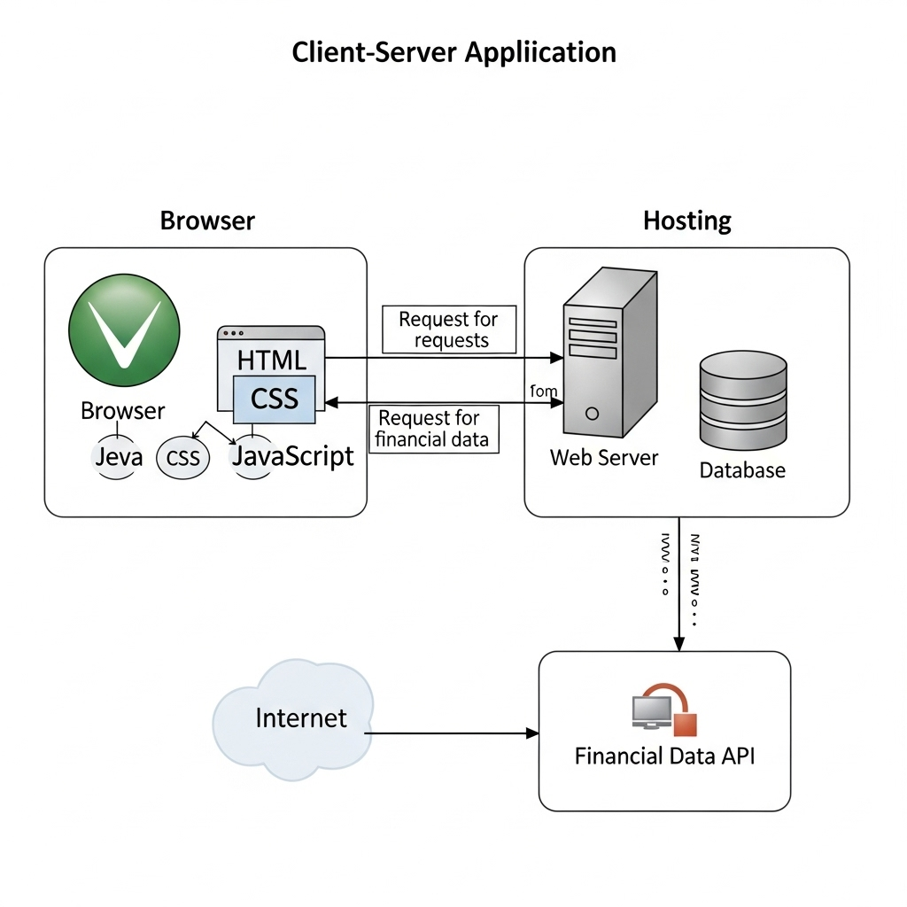

# Arquitetura da solução

<span style="color:red">Pré-requisitos: <a href="05-Projeto-interface.md"> Projeto de interface</a></span>

Documentação da Arquitetura da Solução
1. Visão Geral da Arquitetura

A arquitetura da solução proposta para o projeto "Smart Finance" segue um modelo cliente-servidor distribuído, com o navegador (client-side) responsável pela interface do usuário e uma camada de serviços (server-side) para processamento de dados e acesso a APIs externas. O armazenamento de dados persistente pode ser tanto local no navegador quanto em um servidor de banco de dados associado à hospedagem.

2. Componentes da Solução

A solução é composta pelos seguintes elementos principais, conforme ilustrado na arquitetura:

Navegador (Client-side):

Páginas Web (HTML + CSS + JS): Constituem a interface do usuário (UI) da aplicação. São responsáveis por renderizar o conteúdo, coletar entradas do usuário e interagir com as camadas de dados.
Local Storage: Utilizado para armazenar dados localmente no navegador do usuário. Isso pode incluir preferências do usuário, dados de sessão, ou informações que não necessitam de persistência no servidor, como "Canais", "Comentários" e "Preferidas" (adaptar estes exemplos para o seu contexto, como configurações de exibição ou cache de dados).
Hospedagem (Hosting):

Servidor de Aplicação/Web Server: Onde as Páginas Web são servidas e, possivelmente, onde a lógica de backend (se houver um backend próprio) é executada. A imagem sugere um servidor genérico, que pode ser um ambiente de hospedagem tradicional ou uma plataforma de nuvem.
Banco de Dados (Implícito): Embora não explicitamente desenhado como um componente separado na hospedagem, um sistema como o Smart Finance normalmente requer um banco de dados para persistir informações de usuários, transações, categorias, etc. Este banco de dados estaria associado ao ambiente de hospedagem.
Internet:

Representa a rede de comunicação que conecta o Navegador (client-side) à Hospedagem e às APIs externas.
NewsAPI (Exemplo de API Externa):

A imagem inclui um exemplo de uma API externa (NewsAPI) com endpoints como "TopHeadlines", "Sources", "Everything". No contexto do Smart Finance, esta seria uma API para Dados Financeiros (ou o tipo de dado que sua aplicação consome de fontes externas). Esta API forneceria informações relevantes para o aplicativo, como cotações de investimentos, notícias econômicas, ou qualquer outro dado externo que a aplicação precise consumir.
3. Fluxo de Dados e Interações

O Navegador requisita as Páginas Web da Hospedagem através da Internet.
As Páginas Web interagem com o Local Storage para leitura e escrita de dados locais.
A Hospedagem serve as Páginas Web para o Navegador.
A Hospedagem (ou diretamente o Navegador, dependendo da implementação do frontend) pode se comunicar com a API Externa (NewsAPI / API Financeira) via Internet para buscar dados específicos.
4. Ambiente de Hospedagem da Aplicação

A aplicação (principalmente as Páginas Web) será hospedada em um ambiente de servidor web. As opções de hospedagem podem variar desde um servidor virtual privado (VPS), serviços de hospedagem compartilhada, até plataformas de nuvem (como Vercel, Netlify, AWS S3 para hosting estático, ou plataformas PaaS como Heroku, Google App Engine para aplicações com backend).

Para o Frontend (Páginas Web): O projeto de interface, sendo composto por HTML, CSS e JavaScript, pode ser hospedado como um site estático. Plataformas como Vercel (conforme o link anterior que você me forneceu smart-finance-navy.vercel.app) ou Netlify são excelentes escolhas para essa finalidade, pois oferecem integração contínua, CDN e fácil implantação.
Para o Backend (se aplicável) e Banco de Dados: Se houver uma lógica de negócio no servidor ou um banco de dados próprio (além da NewsAPI), eles seriam hospedados em um ambiente de servidor mais robusto, que pode estar no mesmo provedor de nuvem ou ser um serviço de banco de dados gerenciado (como AWS RDS, Google Cloud SQL, MongoDB Atlas).
5. Pré-requisitos: Projeto de Interface

Para a implementação da solução, os pré-requisitos em relação ao projeto de interface são:

HTML: Estrutura semântica das páginas da aplicação.
CSS: Estilização e design visual da interface, garantindo uma experiência de usuário consistente e responsiva.
JavaScript: Lógica de interatividade do lado do cliente, manipulação do DOM, chamadas a APIs (internas e externas) e gerenciamento do Local Storage.
Figma/Prototipagem (Opcional, mas recomendado): Desenho e prototipagem da interface para validação da experiência do usuário antes da implementação.



## Funcionalidades

Funcionalidades
Esta seção apresenta as funcionalidades da solução Smart Finance.

Funcionalidade 1 - Visualização do Saldo e Transações Recentes

Permite ao usuário visualizar de forma rápida seu saldo atual, as receitas e despesas do mês, e um resumo das suas contas bancárias, além de apresentar as últimas transações de receita e despesa.

Estrutura de dados: Saldo, Receitas, Despesas, Contas, Histórico de Transações.

Instruções de acesso:

Abra o site e efetue o login.
A tela inicial ("Visão Geral") exibirá o saldo atual, as receitas e despesas do mês, o resumo das contas e as transações recentes.
Tela da funcionalidade: ⚠️ COMPLETAR


Funcionalidade 2 - Adicionar Nova Receita

Permite ao usuário registrar uma nova entrada de dinheiro no sistema, detalhando o título, descrição, valor, data, categoria e a conta em que o valor foi depositado.

Estrutura de dados: Receita (Título, Descrição, Valor, Data, Categoria, Conta).

Instruções de acesso:

Abra o site e efetue o login.
Na tela inicial ("Visão Geral"), clique no botão "+" no canto inferior direito.
No pop-up "Nova transação", clique em "Adicionar nova receita".
Preencha os campos: Título, Descrição, Valor, Data (preenchida automaticamente, mas editável), Categoria e Conta.
Clique em "Salvar nova receita" para registrar a entrada ou em "Limpar" para cancelar.
Tela da funcionalidade: ⚠️ COMPLETAR


Funcionalidade 3 - Adicionar Nova Despesa

Permite ao usuário registrar uma nova saída de dinheiro do sistema, detalhando o título, descrição, valor, data, categoria e a conta de onde o valor foi debitado.

Estrutura de dados: Despesa (Título, Descrição, Valor, Data, Categoria, Conta).

Instruções de acesso:

Abra o site e efetue o login.
Na tela inicial ("Visão Geral"), clique no botão "+" no canto inferior direito.
No pop-up "Nova transação", clique em "Adicionar nova despesa".
Preencha os campos: Título, Descrição, Valor, Data (preenchida automaticamente, mas editável), Categoria e Conta.
Clique em "Salvar nova despesa" para registrar a saída ou em "Limpar" para cancelar.
Tela da funcionalidade: ⚠️ COMPLETAR


Funcionalidade 4 - Seleção de Conta

Apresenta uma lista das contas cadastradas para o usuário selecionar ao adicionar uma nova receita ou despesa.

Estrutura de dados: Conta (Nome da Conta).

Instruções de acesso:

Ao adicionar uma nova receita ou despesa, clique no campo "Conta".
Uma janela pop-up ("Escolha uma conta") será exibida, listando as contas disponíveis (Ex: Carteira, Itaú).
Clique na conta desejada para selecioná-la.
Clique em "Selecionar conta" para confirmar ou em "Fechar" para cancelar.
Tela da funcionalidade: ⚠️ COMPLETAR


Funcionalidade 5 - Visualização de Relatório de Balanço Mensal

Apresenta um relatório visual do balanço financeiro do mês, mostrando as receitas e despesas em um gráfico, além dos valores totais de receitas, despesas e o saldo final do período.

Estrutura de dados: Receitas do Mês (Total), Despesas do Mês (Total), Balanço do Mês, representação visual das proporções.

Instruções de acesso:

Abra o site e efetue o login.
Acesse o menu principal e escolha a opção "Relatórios".
A tela exibirá o balanço do mês atual (Junho, 2025 no exemplo) com um gráfico de rosca, o total de receitas, o total de despesas e o balanço.
Utilize as setas "<" e ">" para navegar entre os meses.
Tela da funcionalidade: ⚠️ COMPLETAR


Funcionalidade 6 - Visualização de Relatório de Receitas por Categorias

Apresenta um gráfico de pizza detalhando a distribuição das receitas do mês por diferentes categorias, juntamente com o valor total de cada categoria.

Estrutura de dados: Receitas por Categoria (Nome da Categoria, Valor Total), representação visual das proporções.

Instruções de acesso:

Abra o site e efetue o login.
Acesse o menu principal e escolha a opção "Relatórios".
Role a página para baixo ou navegue até a seção "Receitas por categorias".
Um gráfico de pizza exibirá as categorias de receita (Ex: Salário, Outros, Investimentos, Freelance) com suas respectivas participações, e abaixo estará a lista com o valor total por categoria.
Tela da funcionalidade: ⚠️ COMPLETAR


Funcionalidade 7 - Visualização de Relatório de Despesas por Categorias

Apresenta um gráfico de pizza detalhando a distribuição das despesas do mês por diferentes categorias, juntamente com o valor total de cada categoria.

Estrutura de dados: Despesas por Categoria (Nome da Categoria, Valor Total), representação visual das proporções.

Instruções de acesso: ⚠️ COMPLETAR

Abra o site e efetue o login.
Acesse o menu principal e escolha a opção "Relatórios".
Role a página para baixo ou navegue até a seção "Despesas por categorias".
Um gráfico de pizza exibirá as categorias de despesa (Ex: Transporte, Lazer) com suas respectivas participações, e abaixo estará a lista com o valor total por categoria.


 ⚠️ COMPLETAR


### Estruturas de dados

Descrição das estruturas de dados utilizadas na solução com exemplos no formato JSON.Info.

##### Estrutura de dados - Contatos

Contatos da aplicação

```json
  {
    "id": 1,
    "nome": "Leanne Graham",
    "cidade": "Belo Horizonte",
    "categoria": "amigos",
    "email": "Sincere@april.biz",
    "telefone": "1-770-736-8031",
    "website": "hildegard.org"
  }
  
```

##### Estrutura de dados - Usuários  ⚠️ EXEMPLO ⚠️

Registro dos usuários do sistema utilizados para login e para o perfil do sistema.

```json
  {
    id: "eed55b91-45be-4f2c-81bc-7686135503f9",
    email: "admin@abc.com",
    id: "eed55b91-45be-4f2c-81bc-7686135503f9",
    login: "admin",
    nome: "Administrador do Sistema",
    senha: "123"
  }
```

> ⚠️ **APAGUE ESTA PARTE ANTES DE ENTREGAR SEU TRABALHO**
>
> Apresente as estruturas de dados utilizadas na solução tanto para dados utilizados na essência da aplicação, quanto outras estruturas que foram criadas para algum tipo de configuração.
>
> Nomeie a estrutura, coloque uma descrição sucinta e apresente um exemplo em formato JSON.
>
> **Orientações:**
>
> * [JSON Introduction](https://www.w3schools.com/js/js_json_intro.asp)
> * [Trabalhando com JSON - Aprendendo desenvolvimento web | MDN](https://developer.mozilla.org/pt-BR/docs/Learn/JavaScript/Objects/JSON)

### Módulos e APIs

Esta seção apresenta os módulos e APIs utilizados na solução.

**Images**:

* Unsplash - [https://unsplash.com/](https://unsplash.com/) ⚠️ EXEMPLO ⚠️

**Fonts:**

* Icons Font Face - [https://fontawesome.com/](https://fontawesome.com/) ⚠️ EXEMPLO ⚠️

**Scripts:**

* jQuery - [http://www.jquery.com/](http://www.jquery.com/) ⚠️ EXEMPLO ⚠️
* Bootstrap 4 - [http://getbootstrap.com/](http://getbootstrap.com/) ⚠️ EXEMPLO ⚠️

> ⚠️ **APAGUE ESTA PARTE ANTES DE ENTREGAR SEU TRABALHO**
>
> Apresente os módulos e APIs utilizados no desenvolvimento da solução. Inclua itens como: (1) frameworks, bibliotecas, módulos, etc. utilizados no desenvolvimento da solução; (2) APIs utilizadas para acesso a dados, serviços, etc.


## Hospedagem

Explique como a hospedagem e o lançamento da plataforma foram realizados.

> **Links úteis**:
> - [Website com GitHub Pages](https://pages.github.com/)
> - [Programação colaborativa com Repl.it](https://repl.it/)
> - [Getting started with Heroku](https://devcenter.heroku.com/start)
> - [Publicando seu site no Heroku](http://pythonclub.com.br/publicando-seu-hello-world-no-heroku.html)
